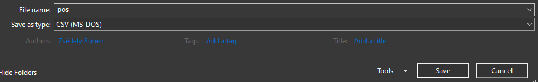
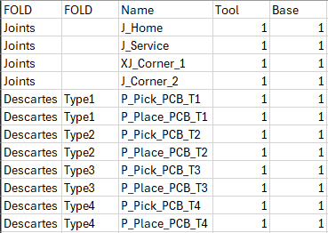

# KUKA position teaching program generator from csv file

A simple tool to generate the positions [.src](https://github.com/zserub/TeachPos-Generator/blob/main/TeachProgram.src) and [.dat](https://github.com/zserub/TeachPos-Generator/blob/main/TeachProgram.dat) files for your KUKA project

*See the outcome of the example.*

## Requirements

- [Python](https://www.python.org/ftp/python/3.10.11/python-3.10.11-amd64.exe)
- (Excel)

## USAGE

Download the latest release and extract in a folder.

In an empty excel, copy your position data, then save it as .csv file. *(See the rules below)*

Save your `pos.csv` file in the **same folder** as the script!

Start the script with `START_script.bat`

*If you don't have python it will warn you and offer a download link, remind you to add it to your PATH and try again.*

*After python is installed run the `START_script.bat` again.*

Enter a start number. The generator will start counting from that number.

### CSV creating rules:

- **Include header**
- add position data, *order doesn't matter*: Name, Tool, Base
- At least one fold is necessary. If you don't want to generate any fold, give it name `root`
- Fold order matters, don't include subfolder for an empty folder
- Any separator works in csv

You are allowed to name the positions with or without X
  
> Position names cannot be longer then 23 characters